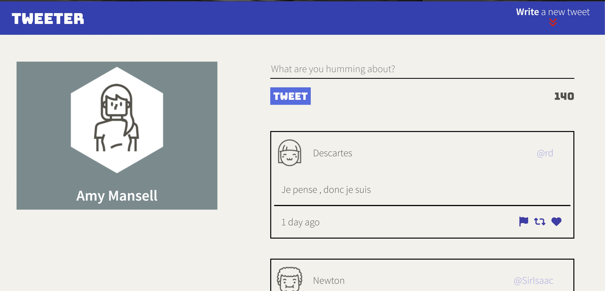
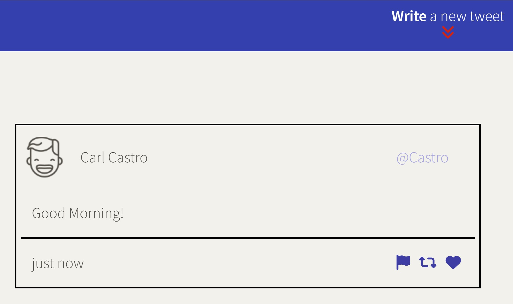
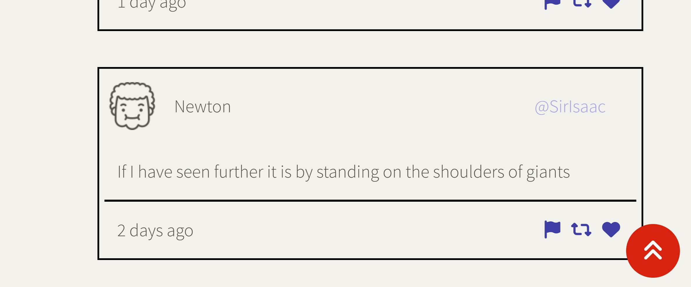
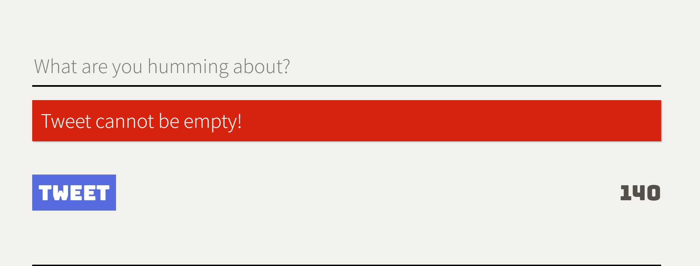
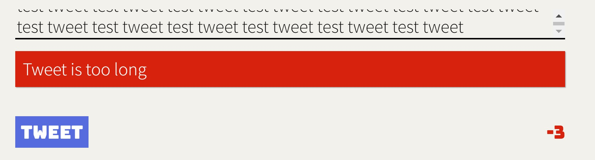

# Tweeter Project

Tweeter is a simple, single-page Twitter built using HTML, CSS, JS, jQuery and AJAX for front-end, and Node, Express for the back-end.

# TECH STACK #

## Languages, Frameworks & Database ##

## Others

## Getting Started

1. Clone this repository onto your local device.
2. Install dependencies using the `npm install` command.
3. Start the web server using the `npm run local` command. The app will be served at <http://localhost:8080/>.
4. Go to <http://localhost:8080/> in your browser.
5. Tweet your feelings away~

## Dependencies

- Express
- Node 5.10.x or above

## Final Product

